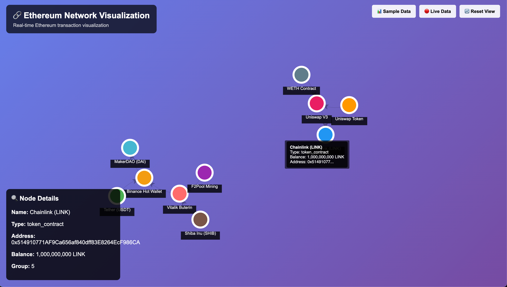

# 🔗 Ethereum Network Visualization

This project visualizes advanced relational transactions on the Ethereum network using a graph-based approach. Graph nodes represent various entities on the network (contracts, wallets, miners), while edges represent transactions between them.



## ✨ Features

- 🎯 **Interactive Visualization**: Mouse controls, zoom, node details
- 📊 **Sample Data**: Ready-to-use Ethereum transaction examples
- 🔴 **Live Data**: Real-time data via Etherscan API
- 🎨 **Modern UI**: Responsive design and user-friendly interface
- 🔍 **Detailed Information**: Tooltips for nodes and links
- 🔄 **Auto Refresh**: View controls and zoom options

## 🚀 Quick Start

### 1. Clone the Repository
```bash
git clone https://github.com/atilaahmettaner/ethereum-network-visualization.git
cd ethereum-network-visualization
```

### 2. Install Dependencies
```bash
npm install
```

### 3. Setup Environment Variables
```bash
cp .env.example .env
```
Open the `.env` file and add your API keys:
- Create an [Alchemy](https://alchemy.com) account and get WebSocket API key
- Create an [Etherscan](https://etherscan.io/apis) account and get API key

### 4. Start the Server
```bash
npm start
```

### 5. Open in Browser
Navigate to `http://localhost:3000`

## 🎮 Usage

### When Page Loads:
- Automatically loads sample Ethereum transactions
- Interactive graph visualization starts

### Controls:
- **📊 Sample Data**: Shows ready-made Ethereum transaction examples
- **🔴 Live Data**: Fetches live data from Ethereum network
- **🔄 Reset View**: Brings graph to optimal view

### Interaction:
- **Mouse Movement**: Drag to move the graph
- **Scroll**: Zoom in/out
- **Click Nodes**: View detailed information
- **Hover Links**: See transaction details

## 🔧 Development

### Run in Development Mode:
```bash
npm run dev
```

### Test Ethereum Data Only:
```bash
npm run ethereum
```

## 🛠️ Technologies

- **Backend**: Node.js, Express.js
- **Frontend**: Vanilla JavaScript, HTML5, CSS3
- **Visualization**: Force-Graph (D3.js based)
- **API**: Etherscan API, Alchemy WebSocket
- **Data**: JSON, RESTful API

## 🔒 Security


- Sample configuration available in `.env.example`

## 📊 Data Sources

- **Etherscan API**: Real Ethereum transaction data
- **Alchemy**: WebSocket connections
- **Sample Data**: Ready-to-use test datasets

## 🤝 Contributing

1. Fork the project
2. Create a feature branch (`git checkout -b feature/amazing-feature`)
3. Commit your changes (`git commit -m 'Add amazing feature'`)
4. Push to the branch (`git push origin feature/amazing-feature`)
5. Open a Pull Request

## 📝 License

This project is licensed under the MIT License.

## 🙏 Acknowledgments

- [Force-Graph](https://github.com/vasturiano/force-graph) library
- [Etherscan](https://etherscan.io) API
- [Alchemy](https://alchemy.com) Platform
